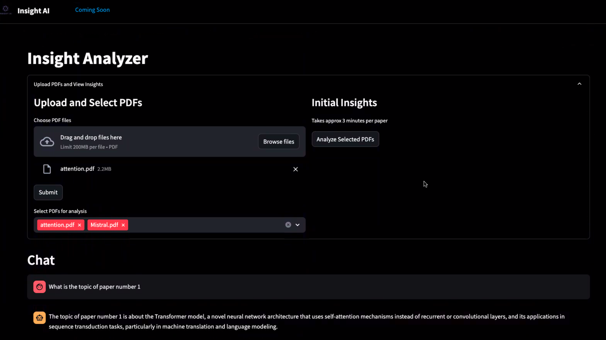
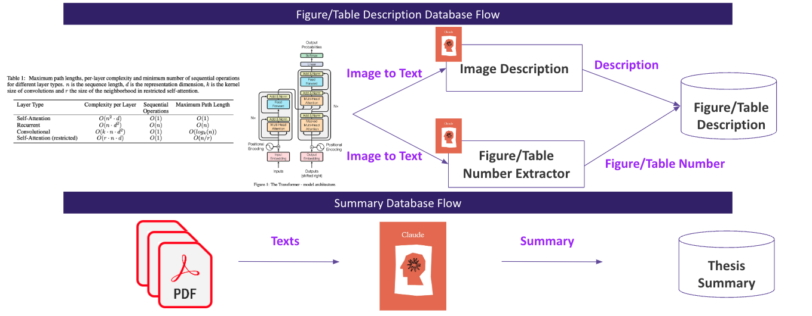
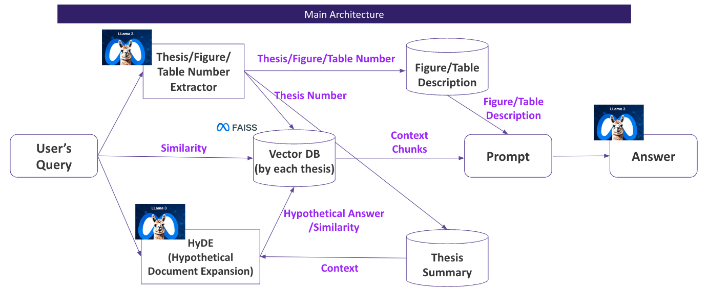
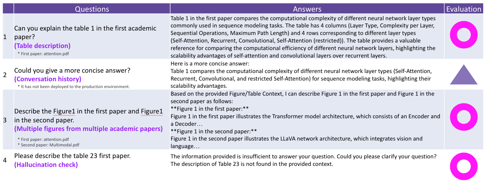

# For Evaluators 

Please follow the steps below to conduct the test from the [UI link](http://209.97.145.117:8501):

1. Enter a username and click "Sign Up." For subsequent visits, use the same username to log in. 
2. Upload a PDF using the "Browse files" button. Note that you can upload PDFs other than the 8 provided for evaluation. 
3. Click "Submit." 
4. From "Select PDFs," choose the PDF you want to ask questions about. 
5. Click "Analyze Selected PDFs." Upon completion, summaries and other details of each academic paper will be displayed.
6. Ask your questions in the "Chat" section. 

**Note 1:** Please be aware that process 5 takes approximately 3-5 minutes per PDF. 
**Note 2:** To improve the accuracy of responses, please specify which academic paper you refer to in your query each time you ask a question (even if you have only selected one PDF). For example: "What is the encoder and decoder explained in the first academic paper?" 
**Note 3:** Conversation history is not implemented in the production environment due to token limits and processing speed (we use Llama3-70B). Therefore, the LLM may not be able to answer questions that require conversation history, such as "Summarize your response." If you are interested in using conversation history, please contact a team member as this would require a model upgrade.

# Introduction

**insightai** is a project developed for the Gen AI Fusion Hackathon Summer 2024(June 27 - July 2, 2024), sponsored by the MS in Applied Data Science program and The University of Chicago Data Science Institute. It was developed by a team of University of Chicago Applied Data Science Master’s students: Daichi Ishikawa, Josh Rauvola, and Sivaram Mandava. This project aims to create an LLM that can answer questions regarding academic paper PDFs uploaded by users, including questions about specific figures and tables.

- **Presentation Slides:** [presentation](slides/presentation.pdf)
- **Sample Questions and Answers Notebook:** [notebook](https://github.com/daichi6/llm-hackathon-insightai/blob/main/notebooks/main.ipynb)
- **Production Code:** **"Insight"** folder
- **UI (Streamlit-based, hosted on AWS):** [http://209.97.145.117:8501](http://209.97.145.117:8501)

# Data Preparation for Search

By leveraging PyMuPDF and AWS Textract, we successfully extracted images and tables, including image and table numbers, ensuring they could be referenced later. Using the Multimodal LLM (Claude Vision Model), we created descriptions for images and tables. Additionally, we identified figure/table numbers in the images and extracted them in a structured text format utilizing few-shot prompting, creating a dataframe. We also created summaries of each academic paper for use in RAG (HyDE) and similarly created a dataframe.

# Main Architecture

The LLM uses information obtained from the following three processes as contexts to generate the final answer:

1. **Thesis/Figure/Table Number Extractor**
   - RAG performs searches based on vector similarity, making it well-suited for broad searches and offering high flexibility. However, when specific thesis numbers or figure numbers are provided, the lack of context can result in lower accuracy. To address this limitation, we incorporated exact match searches for these numbers. By using few-shot prompting, we successfully extracted specific numbers from the user’s query, ensuring more accurate retrieval of the desired figures or tables descriptions.

2. **RAG (Retrieval-Augmented Generation)**
   - In addition to exact match, we use RAG to enable more flexible retrieval that considers the context of the sentences. As the embedding model, we use SciBERT, which is specialized for scientific academic papers. Due to the unique vocabulary and expressions often found in academic papers, it is crucial to use an appropriate embedding. SciBERT retrieves more relevant chunks compared to RoBERTa.

3. **RAG - HyDE (Hypothetical Document Expansion)**
   - HyDE is a method where a hypothetical answer to a question is first generated by an LLM, and then this answer is used to search the VectorDB. In a general RAG setup, we encountered a problem where a user's query was too simple to retrieve highly relevant chunks. To address this, we used HyDE to attempt to retrieve more relevant chunks. However, in the context of academic papers, there are many specialized terms that make it difficult to generate even a hypothetical answer without context. To overcome this, we provided the summary of the target thesis as context, allowing for the generation of more meaningful hypothetical answers for the search. The retrieved chunks with HyDE are generally more relevant to the answers.

# [Sample Questions and Answers](https://github.com/daichi6/llm-hackathon-insightai/blob/main/notebooks/main.ipynb)

*first academic paper: [attention.pdf](https://github.com/daichi6/llm-hackathon-insightai/blob/main/pdfs/attention.pdf)*

**Case 1 - Key Findings**
- **Question:** 'What is the key findings in the first paper?'
- **Answer:** 

The key findings in the first paper are:

1.The proposed Transformer model achieves a new single-model state-of-the-art BLEU score of 41.8 on the WMT 2014 English-to-French translation task, outperforming even all previously reported ensembles.
2.The Transformer model can be trained significantly faster than architectures based on recurrent or convolutional layers, reaching a new state of the art in translation quality after being trained for as little as twelve hours on eight P100 GPUs.
3.The model generalizes well to other tasks, such as English constituency parsing, both with large and limited training data.

These findings suggest that the Transformer model is a powerful and efficient architecture for sequence-to-sequence tasks, particularly in machine translation.

**Case 2 - Figure Description**
- **Question:** 'Describe the Figure1 in the first document.'
- **Answer:** 

Figure 1 in the first document is a flow chart diagram titled "The Transformer - model architecture." It depicts the high-level architecture and key components of a neural network model called the Transformer, which is used for natural language processing tasks. The diagram shows the encoder-decoder structure, multi-head attention, positional encoding, and feed-forward networks, providing a high-level understanding of how the model processes and transforms input sequences into output sequences.

**Case 3 - Table Description**
- **Question:** 'Please explain Table 2 in the first thesis in a way that is easy to understand for someone without technical knowledge.'
- **Answer:** 

I'd be happy to explain Table 2 in a way that's easy to understand for someone without technical knowledge.

Table 2 is a comparison of different machine learning models that can translate languages, specifically from English to German (EN-DE) and English to French (EN-FR). The table shows how well each model performs in terms of translation quality and how much computational power it requires to train.

The table has several columns:

* The first column lists the names of the machine learning models being compared.
* The next two columns show the BLEU scores for each model on the EN-DE and EN-FR translation tasks, respectively. BLEU is a metric that measures how well a machine-generated translation matches a human-generated translation. A higher BLEU score means better translation quality.
* The last column shows the training cost for each model, which is a measure of how much computational power is required to train the model.

The results in the table show that the Transformer models (base and big) perform the best in terms of translation quality, but they also require more computational power to train. Other models, such as ConvS2S and GNMT+RL, also perform well, but with varying levels of computational cost.

In summary, Table 2 is a comparison of different machine learning models for language translation, showing their performance in terms of translation quality and computational cost.

**Case 4 - Multiple Tables and Their Relationship with the Overall Content of the Thesis**
- **Question:** 'Please explain how Table 3 and Table 4 relate to the findings of the first paper?'
- **Answer:**

Based on the provided context, Table 3 and Table 4 are related to the findings of the first paper in the following ways:

Table 3 presents variations on a Transformer neural network architecture, exploring different hyperparameters such as model size, hidden dimensions, attention heads, and sinusoidal positional embeddings. The table shows that increasing model size and depth generally improves language modeling perplexity, with the best result achieved by the largest model (E).

Table 4 compares the parsing F1 scores of different models on the WSJ dataset. The table demonstrates that the Transformer generalizes well to parsing, achieving a competitive F1 score of 90.4, which is better than previous generative models.

The findings of the first paper, as presented in these tables, suggest that the Transformer architecture is effective for natural language processing tasks, particularly constituency parsing. The results also highlight the importance of architectural choices, such as model size and depth, in achieving good performance.

In the context of the paper, these tables provide evidence for the effectiveness of the Transformer architecture and its variants, and demonstrate the potential of self-attention mechanisms for natural language processing tasks.

**Case 5 - Detail Description without Figure/Table Numbers**
- **Question:** 'What are the encoder and decoder as explained in thesis 1? How many layers does each consist of?'
- **Answer:**

According to the provided Text Context, specifically Chunk 2 and Chunk 3, the encoder and decoder in the Transformer model are composed of a stack of N = 6 identical layers. Each layer in the encoder has two sub-layers: a multi-head self-attention mechanism and a simple, position-wise fully connected feed-forward network. The decoder also has these two sub-layers, plus a third sub-layer that performs multi-head attention over the output of the encoder stack.

# Additional Questions for Further Testing

In addition to the sample questions provided by the hackathon guidelines, the LLM was able to answer questions about table descriptions and multiple figures from various academic papers while maintaining conversation history. Additionally, it successfully avoided hallucinations. For the conversation history, when conversations span multiple interactions, there is a tendency for the response time to increase and the accuracy to decrease due to the length of the prompts, indicating a need for improvement.

# Future Work

- **RAG - Improving Chunking Methods:** In this project, we used a fixed-length chunking method, but there is potential for creating more contextually meaningful chunks. Especially in academic papers, subsections or paragraphs often have clear delineations. Adopting such chunking methods could improve the accuracy of the RAG model.
- **Image Embedding:** In this project, we converted images into text descriptions before embedding. However, this process might result in some information loss (despite our efforts to minimize this by specifying 11 detailed items for each description). Exploring direct image embedding could be worthwhile.
- **Fine-tuning:** We used SciBERT, an embedding model specialized for scientific academic papers, but fine-tuning could create a model even more tailored to AI-focused papers. Additionally, while we used a pre-trained LLM, fine-tuning LLM could further enhance response accuracy.
- **Adaptation Beyond Typical Academic Papers:** Our primary use case was academic papers, where we retrieved descriptions using figure/table numbers as keys. However, some sample PDFs lacked figure/table numbers. Considering these PDFs also had limited text, integrating text descriptions of each image back into the original PDF before applying RAG could potentially improve accuracy.
